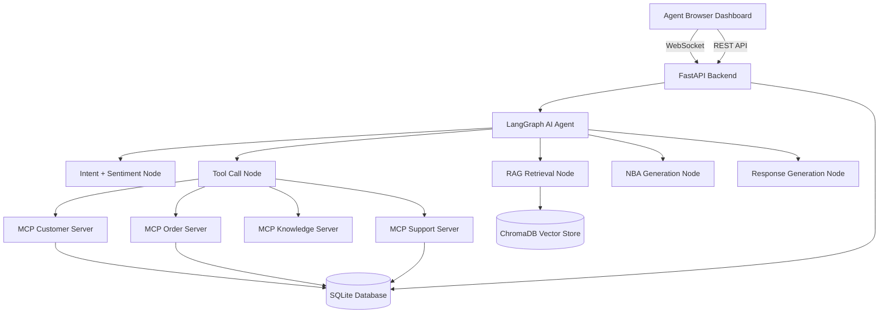

# Live Call Co-pilot

An AI-powered real-time assistant that helps customer-service and sales agents during live calls.

---

## What It Does

Live Call Co-pilot listens to a customer conversation in real time, analyzes intent and sentiment, retrieves relevant company policies, calls business system tools when needed, and displays an agent dashboard showing:

- **Customer Intent** — what the customer actually wants
- **Sentiment** — emotional tone (frustrated, angry, neutral, positive)
- **Next Best Action** — exactly what the agent should do right now
- **Suggested Response** — a natural, professional response the agent can use
- **Relevant Policy** — company policy retrieved via semantic search (RAG)
- **Customer & Order Details** — fetched from the business system in real time
- **Post-call Summary** — structured summary with actions and follow-up items

The AI assists the human agent — it does not replace them.

---

## Architecture



---

## Tech Stack

| Layer | Technology |
|---|---|
| Frontend | React 18, Vite, TypeScript |
| Backend | Python 3.11, FastAPI, uvicorn |
| Real-time | WebSockets (native) |
| AI Agent | LangGraph, LangChain |
| LLM | OpenRouter / any OpenAI-compatible API |
| Embeddings | sentence-transformers (local, no API key) |
| Vector DB | ChromaDB (persistent local) |
| Database | SQLite + SQLAlchemy |
| MCP | Python MCP SDK (4 in-process servers) |

---

## How the AI Agent Works

### LangGraph Workflow

```
START
  → update_state          (initialize defaults, reset counters)
  → analyze_intent_sentiment  (LLM structured output: intent, sentiment, stage, entities)
  → retrieve_knowledge    (semantic RAG search on ChromaDB)
  → [conditional] call_tool   (if analysis decides a tool is needed)
  → generate_nba_response     (LLM structured output: NBA + suggested response)
END
```

Every customer turn triggers a complete pipeline run. The LangGraph graph compiles once at startup and is reused for all calls.

### Structured LLM Outputs

All LLM outputs use Pydantic schemas with `with_structured_output()`:
- `IntentSentimentAnalysis` — intent, confidence, sentiment, stage, entities, tool decision
- `NextBestAction` — action, priority, rationale, suggested_response
- `CallSummaryGenerated` — post-call structured summary

This eliminates fragile text parsing and ensures the frontend always receives valid, typed data.

---

## RAG Implementation

1. **Documents** — 7 company policy markdown files in `data/knowledge_base/`
2. **Chunking** — paragraph-aware splitting (512 chars, 64 overlap)
3. **Embeddings** — `all-MiniLM-L6-v2` via sentence-transformers (runs locally)
4. **Storage** — ChromaDB persistent collection
5. **Retrieval** — cosine similarity search, top-3 results, score threshold 0.35
6. **Prompt injection** — retrieved chunks formatted and injected into NBA prompt

The knowledge base is ingested on first startup and cached. Use `force_reingest=True` to refresh.

---

## Tool Calling

The agent decides whether a tool is needed based on the conversation. If so, it sets `requires_tool_call=True` and specifies which tool + parameters.

Available tools:

| Tool | Description |
|---|---|
| `get_customer(customer_id)` | Fetch customer from SQLite |
| `get_order_status(order_id)` | Fetch order details and tracking |
| `get_customer_orders(customer_id)` | List all orders for a customer |
| `get_available_resolution_options(order_id)` | List resolution options by order status |
| `search_policy(query)` | Semantic search on policy knowledge base |
| `create_support_ticket(...)` | Create a real ticket in SQLite |

The agent **never fabricates** customer or order data. If information is unavailable, it says so.

---

## MCP Architecture

Four MCP servers expose business capabilities:

| Server | Tools |
|---|---|
| `customer_server.py` | `get_customer`, `search_customer_by_email` |
| `order_server.py` | `get_order_status`, `get_customer_orders`, `get_available_resolution_options` |
| `knowledge_server.py` | `search_policy` |
| `support_server.py` | `create_support_ticket` |

The MCP servers run in-process using stdio transport. The agent calls the same underlying Python functions directly for performance; the MCP servers expose the same capabilities for external system integration.

---

## Real-time Transcription

**Current mode:** Browser Web Speech API (Chrome)
- Client captures microphone audio
- Converts speech to text natively in the browser
- Sends transcript chunks over WebSocket to the backend

**Manual mode:** Type/paste conversation turns in the dashboard input area — great for demos.

**Provider-configurable:** Set `STT_PROVIDER` in `.env`:
- `browser` — Web Speech API (default, no key needed)
- `deepgram` — Deepgram streaming (requires `STT_API_KEY`)
- `assemblyai` — AssemblyAI streaming (requires `STT_API_KEY`)

---

## Next Best Action System

The NBA engine considers:
- Full conversation history (not just the last message)
- Detected intent and confidence
- Customer sentiment
- Conversation stage
- Retrieved policy knowledge
- Tool call results (order status, customer info)
- Customer membership tier

It produces one of these actions with a priority and rationale:
`ask_for_order_number`, `verify_customer_identity`, `check_order_status`, `search_policy`, `offer_refund`, `offer_replacement`, `escalate_to_supervisor`, `create_support_ticket`, `explain_options`, `close_conversation`, `ask_clarifying_question`, `provide_tracking_info`, `process_cancellation`, `process_return`

---

## Database

SQLite with SQLAlchemy ORM. Tables:

| Table | Purpose |
|---|---|
| `calls` | Call sessions with status and summary |
| `transcripts` | Individual conversation turns with AI labels |
| `action_items` | Post-call action items |
| `customers` | Customer records (5 demo records seeded) |
| `orders` | Order records (7 demo records seeded) |
| `support_tickets` | Tickets created during calls |
| `evaluation_results` | Evaluation run results |

---

## Evaluation

Run `evaluation/evaluate.py` to measure pipeline quality:

```bash
python evaluation/evaluate.py
```

Metrics produced:
- **Intent accuracy** — % of scenarios where intent was correctly classified
- **Sentiment accuracy** — % where sentiment was correctly identified
- **NBA accuracy** — % where next best action matched expected keyword
- **Tool call accuracy** — % where correct tool was called
- **Average latency** — end-to-end AI processing time in ms
- **Error rate** — % of scenarios that had LLM/tool errors

---

## Setup Instructions

### Prerequisites

- Python 3.11+
- Node.js 18+
- An LLM API key (OpenRouter recommended — supports GPT-4o-mini, Claude, Gemini)

### 1. Clone and Configure

```bash
cd "Live Call AI"
cp .env.example .env
# Edit .env — add your LLM_API_KEY
```

### 2. Install Backend Dependencies

All major packages are pre-installed. If needed:

```bash
pip install fastapi uvicorn langchain langchain-openai langgraph chromadb sentence-transformers pydantic-settings mcp python-dotenv sqlalchemy
```

### 3. Install Frontend Dependencies

```bash
cd frontend
npm install
```

### 4. Run the Backend

```bash
# From project root:
cd backend
python run.py
# OR: uvicorn app.main:app --reload --host 0.0.0.0 --port 8000
```

On first run, the backend will:
- Create the SQLite database and seed demo data
- Download the embedding model (~25MB, one time)
- Ingest 7 policy documents into ChromaDB

### 5. Run the Frontend

```bash
cd frontend
npm run dev
```

Open `http://localhost:5173`

---

## Environment Variables

| Variable | Default | Description |
|---|---|---|
| `LLM_API_KEY` | — | **Required.** OpenRouter or OpenAI API key |
| `LLM_BASE_URL` | `https://openrouter.ai/api/v1` | LLM API endpoint |
| `LLM_MODEL` | `openai/gpt-4o-mini` | Model name |
| `LLM_TEMPERATURE` | `0.1` | LLM temperature |
| `EMBEDDING_MODEL` | `all-MiniLM-L6-v2` | Local embedding model |
| `DATABASE_URL` | `sqlite:///./live_call_ai.db` | Database connection |
| `VECTOR_DB_PATH` | `./data/chroma_db` | ChromaDB storage path |
| `STT_PROVIDER` | `browser` | `browser` / `deepgram` / `assemblyai` |
| `STT_API_KEY` | — | API key for non-browser STT providers |

---

## Example Workflow

1. Open the dashboard at `http://localhost:5173`
2. Select a customer (e.g., Sarah Johnson — CUST-001)
3. Click **Start Call**
4. Type a customer message: *"My order ORD-10001 hasn't arrived and I need it urgently"*
5. Watch the AI co-pilot panel update:
   - Intent: **delivery_issue**
   - Sentiment: **frustrated**
   - Tool called: `get_order_status(ORD-10001)` → returns real DB data
   - NBA: **check_order_status**
   - Suggested Response: *"I'm sorry about the delay. I've pulled up order ORD-10001 — it's currently in transit with FedEx (tracking: TRK-9821347)..."*
   - Policy retrieved: Shipping and Delivery Policy
6. Type the agent reply, continue the conversation
7. Click **End Call** → post-call summary modal appears

---

## Project Structure

```
Live Call AI/
├── backend/
│   ├── app/
│   │   ├── main.py            # FastAPI app + lifespan startup
│   │   ├── config.py          # pydantic-settings config
│   │   ├── database.py        # SQLAlchemy + seeding
│   │   ├── models/            # ORM models
│   │   ├── schemas/           # Pydantic API schemas + AI schemas
│   │   ├── api/               # REST routes
│   │   ├── agents/            # LangGraph graph, nodes, state, prompts
│   │   ├── tools/             # Business tool functions
│   │   ├── mcp/               # MCP server implementations
│   │   ├── rag/               # Embeddings, ingestion, retriever
│   │   ├── services/          # LLM, STT, summary services
│   │   └── websocket/         # WS connection manager + handler
│   └── run.py
├── frontend/
│   └── src/
│       ├── components/        # TranscriptPanel, CopilotPanel, etc.
│       ├── pages/             # Dashboard
│       ├── services/          # WebSocket client, API client
│       ├── hooks/             # useCallSession
│       └── types.ts           # Shared TypeScript types
├── data/
│   └── knowledge_base/        # 7 company policy documents
├── evaluation/
│   ├── datasets/              # Test scenarios JSON
│   └── evaluate.py            # Evaluation runner
├── .env.example
└── README.md
```

---

## Future Improvements

- **Real STT streaming** — integrate Deepgram/AssemblyAI for true microphone streaming
- **Multi-call dashboard** — supervisor view of multiple active calls
- **Historical analytics** — call volume, sentiment trends, NBA accuracy over time
- **Human feedback loop** — agents rate suggested responses to improve NBA quality
- **More MCP integrations** — CRM, ticketing systems (Salesforce, Zendesk)
- **Streaming AI responses** — stream NBA and response as tokens arrive
- **Fine-tuning** — fine-tune the NBA model on approved agent responses
